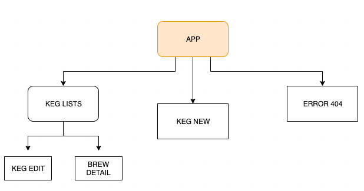

# _Taproom React_

#### _A web application of a clone of an Angular project using React._

#### By _**Kenny Halim**_

## Description

_A web application that allows user to see different lists of kegs and be able to edit and add new keg._

## Planning

__

## Setup/Installation Requirements

- Download and install Node.js
- Clone this repository: \$ git clone repo name
- Change into the work directory: \$ cd repo name
- Run the command \$ npm install
- Run the command \$ npm run start

## Support and contact details

_If you run into any issues or have questions, ideas or concerns. Please contact us at kennyhalim98@gmail.com_

## Technologies Used

- HTML
- CSS
- Javascript
- React
- WebPack
- Node Package Manager

### License

_MIT_

Copyright (c) 2019 **_Kenny Halim_**
